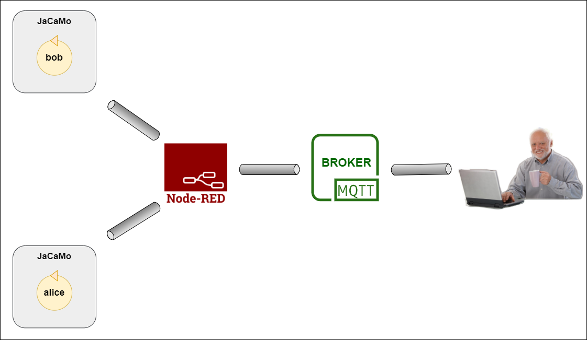
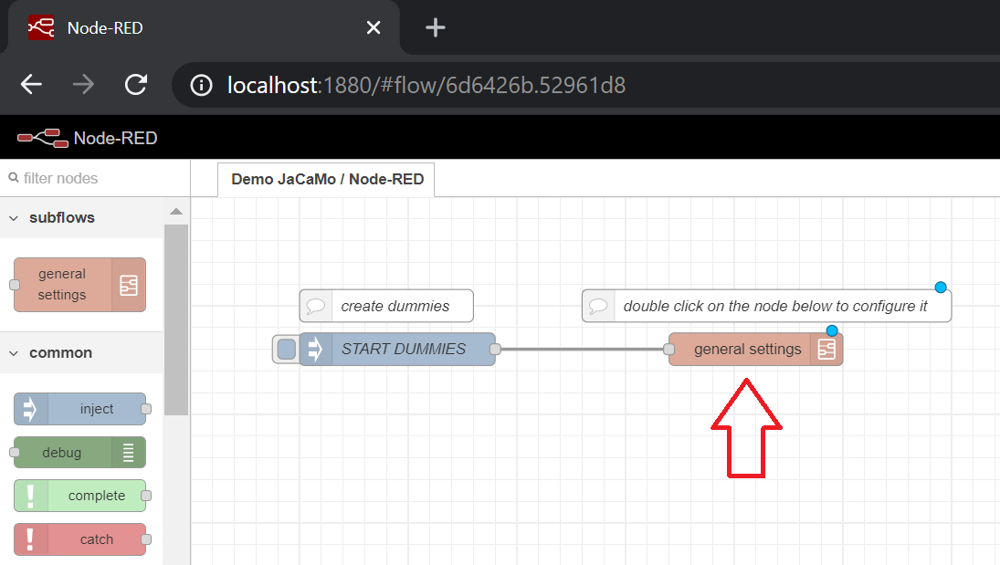
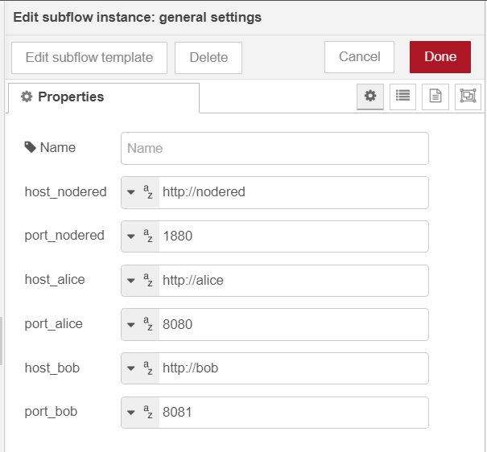
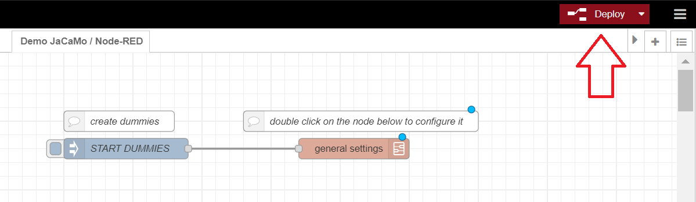
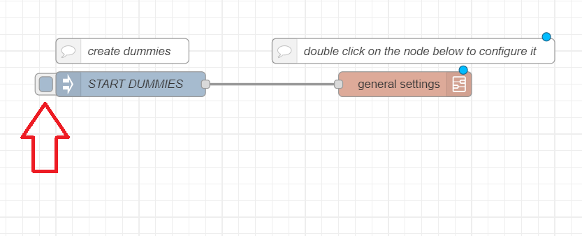
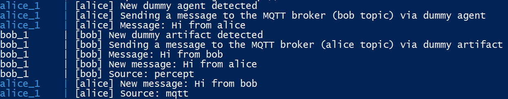
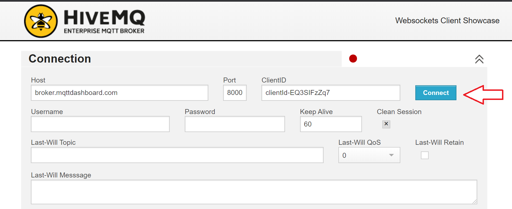
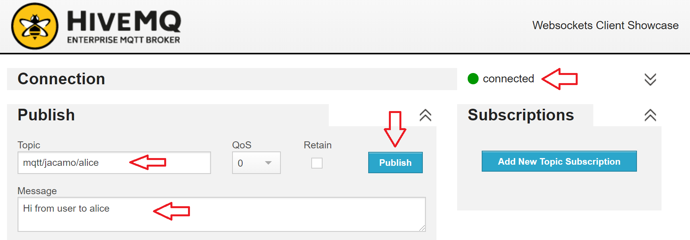
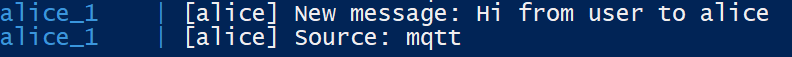

# JaCaMo-REST: Integration Demo (Node-RED + MQTT)

This demo presents an integration scenario where agents leverage the MQTT protocol in their usual interaction ways:
- through ACL message or
- action and perception.


## Understanding the demo

The scenario consists of five entities:
* Two JaCaMo applications, one for agent `alice` and another for `bob`
* Node-RED
* MQTT Broker
* You

An overview is below:




In this scenario, the agents interact with an _MQTT broker_. [MQTT](http://mqtt.org/) is a lightweight protocol for messaging transport in a publish/subscribe pattern, and an MQTT broker is a server that receives messages from _publishers_ and routes them to the appropriate _subscribers_. MQTT clients publish and subscribe to so-called _topics_. Alice and bob subscribe to topics _mqtt/jacamo/alice_ and _mqtt/jacamo/bob_, respectively. It means that alice receives messages published to topic mqtt/jacamo/alice, and bob receives those published to topic mqtt/jacamo/bob.

A central entity to this scenario is the [Node-RED](https://nodered.org/), an integration tool that provides a browser-based editor to wire together hardware devices, APIs, and online services using a wide range of _nodes_. Here, it is responsible for integrating the JaCaMo apps and the MQTT broker.

The Node-RED integrates broker and agents using __dummy entities__. They are jacamo-rest resources exclusively used to "represent" _external entities*_ inside the MAS (in this case, an MQTT broker). They can be of two types: ___dummy agent___ for modeling an external entity as an agent and ___dummy artifact___ for modeling it as an environment artifact. The Node-RED connects with dummies through jacamo-rest facilities. Combining Node-RED and dummies for wrapping external entities inside the MAS keeps integration issues (e.g., different protocols and data formats) transparent to agents, which keep using ACL or action/perception to interact with them.
> \* An external entity can be an application, a system, a sensor, etc., located outside the MAS boundaries and that needs to access/be accessed by agents.

In this demo, for didactical reasons, the MQTT broker is differently modeled in the two JaCaMo applications. On one hand, alice interacts with MQTT as if it were another agent, i.e., via ACL message. On the other hand, MQTT is an artifact for bob, who can execute its operations and perceive its signals and observable properties.


## Running with Docker
#### Prerequisites:
- [Docker](https://docs.docker.com/engine/install/)
- [Docker Compose *](https://docs.docker.com/compose/install/)
> \* On desktop systems like Docker Desktop for Mac and Windows, Docker Compose is included as part of those desktop installs.


1. Make sure you are in the root directory of this project

2. Open a command-line shell and run Node-RED and JaCaMo applications via Docker Compose:
  ```bash
  docker-compose -f docker-compose.yml -p your_project_name up
  ```


## Running with Gradle
#### Prerequisites:
- [Gradle](https://gradle.org/install/)
- [Node.js](https://nodejs.org/en/download/)
- [Node-RED](https://nodered.org/docs/getting-started/local)

1) Make sure you are in the root directory of this project

__(Under Construction)__

## <a name="guide"></a>To try this demo

After running the applications, open a browser and go to the Node-RED editor, located by default on port 1880.
  ```
  http://localhost:1880/
  ```

First, you must check the settings. It is done in the ___general settings___ node. Double click on it.



By default, hosts and ports are set with docker values. If you are __not__ using docker, change host and port properties to the appropriate values. After checking the settings, click on _Done_ button to close the configuration panel.



If you have changed some property, it needs to be deployed to start taking effect. It is done by pressing the ___Deploy___ button on the top right of the editor.



> __Attention:__ Whenever a property is edited in the Node-RED, you need to click on the ___Deploy___ button for it to take effect.

Now, you must create the dummy entities (those representing the MQTT inside the MAS applications). Click on the button of the __START DUMMIES__  node.



By clicking on this button, the Node-RED creates the dummy entities and notifies alice and bob about it. Then, the agents send a greeting message to the MQTT broker through the dummies. Alice publishes to bob topic and vice versa.



After the dummies' creation, you can now effectively participate in the demo by sending messages to the agents through an MQTT client. Follow the next steps to do so via [HiveMQ](https://www.hivemq.com/):

1. Open the [HiveMQ Client](http://www.hivemq.com/demos/websocket-client/)

2. Keep the default settings and click on __Connect__

  

3. Wait for the client to be connected to the server. On the __Publish__ tab, set the _Topic_ name (_mqtt/jacamo/alice_ or _mqtt/jacamo/bob_), type the desired message, and click on _Publish_.

  

4. See the result by checking the logs in the command-line shell where the agents are running.

  
